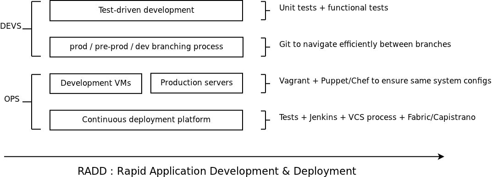

!SLIDE subsection

# What is DevOps? #
## Introduction ##

!SLIDE center

# How many here consider themselves SysAdmins/Ops? #

!SLIDE center

# How many here consider themselves Developers? #

!SLIDE center

# Ops: how many of you have <strong>never</strong> written more than 50 lines of code? #

!SLIDE center

# Developers: how many of you have <strong>never</strong> deployed an application on a server? #

!SLIDE center

# For the end-user of an application, there is no such thing as dev or ops. #

# For him there is only one type of people: IT people #

!SLIDE

# Wikipedia #
## Definition of DevOps ##

 
 
 

### <em>"DevOps" is an emerging set of principles, methods and practices for communication, collaboration and integration between software development and IT operations professionals.</em> ###

### <em>It has developed in response to the emerging understanding of the interdependence and importance of both the development and operations disciplines in meeting an organization's goal of rapidly producing software products and services.</em> ###

!SLIDE incremental

# The fundamental DevOps contradiction #
## Devs VS Ops #

* Developers are asked to deliver new value, often and fast

* Operations people are asked to protect the current value

* <strong>Pro-Change VS Pro-Stability</strong>

!SLIDE center

# Silos #

!SLIDE center

# Break the silos #

!SLIDE center

# DevOps do RADD #

!SLIDE

# DevOps create the infrastructure that empower devs from the first line of code to the delivery #
## How to be DevOps? ##

* Configuration management for rapid, repeatable server setup
* Deployment scripts to abstract sysadmin tasks and empower developers
* Development VMs with prod configuration to ensure consistency and avoid unexpected system-related bugs
* Continuous deployment to make it <strong>fast</strong>!

!SLIDE center

# DevOps is spreading agility to the whole IT project lifecycle #

!SLIDE smaller

# Of course, open-source is the main force behind devops #
## Devops and open-source ##

* <strong>Puppet</strong> - Ruby - github.com/puppetlabs/puppet
* <strong>Chef</strong> - Ruby - github.com/opscode/chef
* <strong>Vagrant</strong> - Ruby - github.com/mitchellh/vagrant
* <strong>Fabric</strong> - Python - github.com/fabric/fabric
* <strong>Jenkins</strong> - Java - github.com/jenkinsci/jenkins